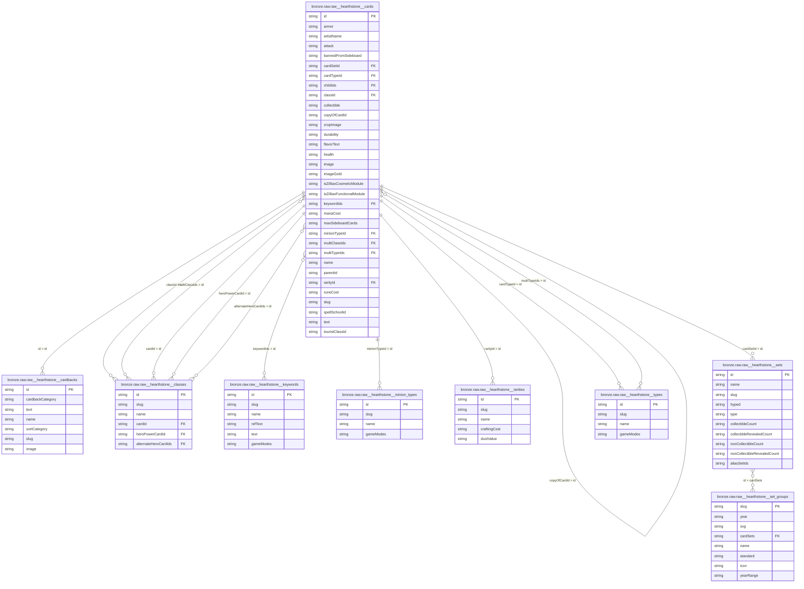

# Arcane Insight
Arcane Insight is a data analytics project designed to harness the power of SQLMesh & DuckDB to collect, transform, and analyze data from Blizzard’s Hearthstone API.
Focused on card statistics and attributes, this project reveals detailed insights into card mechanics, strengths, and trends to support BI and strategic analysis.

## ERDs
### Bronze
