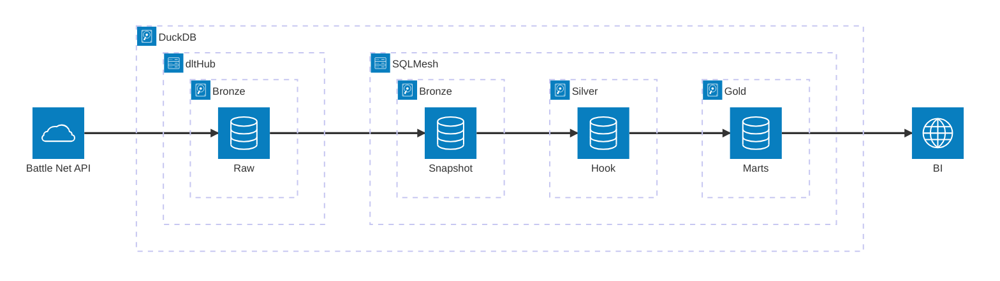
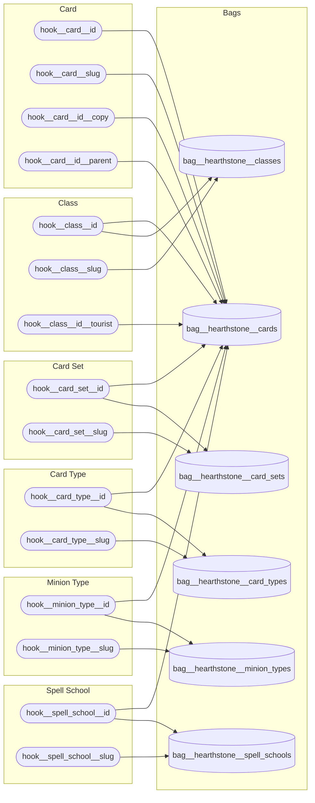
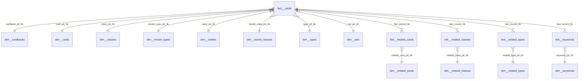

# Arcane Insight
   

Arcane Insight is a data analytics project designed to harness the power of SQLMesh & DuckDB to collect, transform, and analyze data from [Blizzard's Hearthstone API](https://develop.battle.net/documentation/hearthstone).

Focused on card statistics and attributes, this project reveals detailed insights into card mechanics, strengths, and trends to support BI and strategic analysis.

## Diagrams
### Architecture

### Bronze
#### bronze.raw.*

```mermaid
erDiagram
    raw__hearthstone__bg_game_modes
    raw__hearthstone__cardback_categories
    
    raw__hearthstone__cards }|--|| raw__hearthstone__cards: "parentId > id"
    raw__hearthstone__cards }|--|| raw__hearthstone__cards: "childIds > id"
    raw__hearthstone__cards||--|| raw__hearthstone__cards: "copyOfCardId > id"
    
    raw__hearthstone__cards||--|{ raw__hearthstone__cardbacks: "id > id"
    raw__hearthstone__cards||--|{ raw__hearthstone__classes: "classId > id"
    raw__hearthstone__cards }|--|{ raw__hearthstone__classes: "multiClassIds > id"
    raw__hearthstone__cards }|--|{ raw__hearthstone__keywords: "keywordIds > id"
    raw__hearthstone__cards||--|{ raw__hearthstone__minion_types: "minionTypeId > id"
    raw__hearthstone__cards||--|{ raw__hearthstone__rarities: "rarityId > id"
    raw__hearthstone__cards||--|{ raw__hearthstone__sets: "cardSetId > id"
    raw__hearthstone__cards||--|{ raw__hearthstone__types: "cardTypeId > id"
    raw__hearthstone__cards }|--|{ raw__hearthstone__types: "multiTypeIds > id"
    raw__hearthstone__cards ||--|{ raw__hearthstone__spell_schools: "multiTypeIds > id"
    
    raw__hearthstone__classes }|--|| raw__hearthstone__cards: "cardId > id"
    raw__hearthstone__classes }|--|| raw__hearthstone__cards: "heroPowerCardId > id"
    raw__hearthstone__classes }|--|{ raw__hearthstone__cards: "alternateHeroCardIds > id"
    
    raw__hearthstone__keywords ||--|{ raw__hearthstone__game_modes: "gameModes > id"
    raw__hearthstone__mercenary_factions
    raw__hearthstone__mercenary_roles
    raw__hearthstone__minion_types ||--|{ raw__hearthstone__game_modes: "gameModes > id"
    raw__hearthstone__sets }|--|{ raw__hearthstone__set_groups: "id > cardSets"
    raw__hearthstone__spell_schools ||--|{ raw__hearthstone__game_modes: "gameModes > id"
    raw__hearthstone__types ||--|{ raw__hearthstone__game_modes: "gameModes > id"
```

### Silver
#### silver.hook.*

### Gold
#### gold.mart__cards.*

